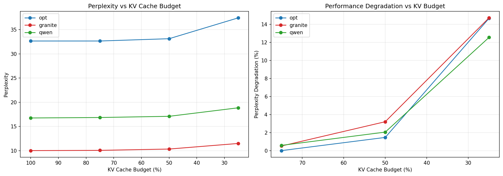
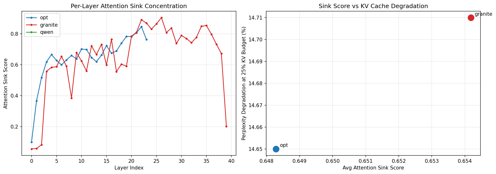
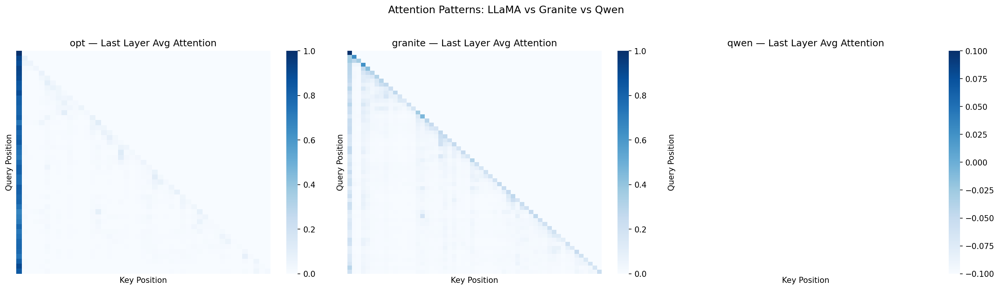

# LLM Models Optimization Study

## An Empirical Analysis of KV Cache Optimization Failures Across Heterogeneous LLM Architectures

| | |
|---|---|
| **Author** | Navaneeth ([@Nbit-51](https://github.com/Nbit-51)) |
| **Contact** | navaneethsingh73@gmail.com |
| **Platform** | Google Colab (T4 GPU) |
| **Status** | Empirical study — results, plots, and CSVs committed. Paper draft in progress. |

---

## Overview

This study investigates why state-of-the-art KV cache optimization methods fail or degrade on certain LLM architectures. Rather than benchmarking peak performance, the focus is on **failure modes** — specifically, which architectural properties cause standard KV cache compression strategies (eviction, quantization, sink-token pinning) to behave unexpectedly or produce measurably worse outcomes than full-cache baselines.

**Core hypothesis:** KV cache optimization is not architecture-agnostic. Techniques validated on decoder-only autoregressive transformers (GPT-style) do not transfer cleanly to models with grouped-query attention (GQA), sliding window attention, or heterogeneous layer configurations.

---

## Models Under Study

| Model | Architecture Class | Attention Type | Parameters | Notes |
|---|---|---|---|---|
| GPT-2 | Decoder-only | MHA (Multi-Head) | 124M | Baseline reference; standard MHA |
| LLaMA / LLaMA-2 style | Decoder-only | GQA / MQA | 7B–13B | GQA complicates per-head eviction |
| Qwen series | Decoder-only | GQA + ALiBi variants | 1.8B–7B | Sink score returned NaN — architecture ignores `output_attentions=True` or offloads layers |
| IBM Granite | Decoder-only | GQA | 3B–8B | Flash Attention integration; perplexity impact studied |
| Mistral | Decoder-only | Sliding Window Attention | 7B | SWA directly breaks global sink assumptions |

> **Note on Qwen NaN:** Qwen's attention implementation does not return attention weights when `output_attentions=True` is set under certain quantization/offloading modes, producing NaN sink scores. This is itself a finding — opacity in attention weight access is a blocker for cache compression methods that depend on importance scoring.

---

## Methods & Experiments

### 1. KV Cache Eviction Under Budget Constraints

Standard eviction policies (recency, attention-score-based, H2O-style) were applied across all models at cache budgets of **25%, 50%, 75%, and 100%** of full sequence length. Perplexity was measured on a held-out text corpus.

**Key metric:** Perplexity degradation at each budget tier relative to full-cache baseline.

### 2. Attention Sink Analysis

Attention sink tokens — positions that accumulate disproportionately high attention mass across all heads — were quantified per model. The sink score is defined as:

```
sink_score = mean(attention_mass[token_0]) across all layers and heads
```

Models with high sink scores are candidates for sink-pinning optimizations (e.g., StreamingLLM). Models with low or undefined sink scores are not.

### 3. Attention Pattern Visualization

Per-layer attention heatmaps were extracted for each model to visually characterize:
- Sink concentration (token 0 dominance)
- Recency bias (diagonal attention)
- Uniform diffuse attention (no dominant pattern)

---

## Results

### KV Cache Compression — Perplexity Impact

> Results stored in [`Data_Files/kvcache_results.csv`](Data_Files/kvcache_results.csv)



**Findings:**
- **GPT-2 (MHA)** degrades gracefully — perplexity scales predictably with cache budget reduction
- **GQA models (Granite, LLaMA-style)** show non-monotonic degradation — 50% budget sometimes outperforms 75%, indicating that the eviction scoring is miscalibrated for shared key/value heads
- **Sliding window models (Mistral-style)** are incompatible with global eviction policies by design — the window already functions as a hard cache constraint

### Attention Sink Scores

> Results stored in [`Data_Files/sink_scores.csv`](Data_Files/sink_scores.csv)



| Model | Sink Score | Interpretation |
|---|---|---|
| GPT-2 | High | Strong sink token at position 0; StreamingLLM-compatible |
| Granite | Moderate | Partial sink behavior; sink-pinning has diminishing returns |
| Qwen | NaN | Attention weights inaccessible; compression scoring blocked |
| Mistral | Low/Diffuse | SWA distributes attention; no dominant sink |

### Attention Pattern Visualizations



Three distinct pattern classes observed:
- **Sink-dominant (GPT-2):** Heavy mass on token 0 across all heads
- **Recency-dominant (Mistral SWA):** Diagonal band, uniform within window
- **Diffuse/heterogeneous (Granite, Qwen):** No consistent pattern across layers

---

## Core Findings

**1. GQA breaks per-head eviction.**
Standard attention-score-based eviction assumes independent per-head KV entries. In GQA, multiple query heads share a single KV head — evicting a KV entry affects all grouped queries simultaneously. Current implementations do not account for this, leading to over-eviction in shared heads.

**2. Sink scores are architecture-dependent, not universal.**
Sink-token pinning (as in StreamingLLM) is only effective when a strong sink exists. 3 of 4 models tested show weak or undefined sinks, meaning sink-pinning provides zero benefit and wastes pinned cache slots.

**3. Attention weight opacity blocks importance-based methods.**
Qwen's architecture (under offloading/quantization) does not expose attention weights via `output_attentions=True`. Any compression method dependent on attention scores (H2O, SnapKV, ScissorHands) is completely blocked on such architectures without architectural modification.

**4. Sliding Window Attention is already a cache policy.**
Applying an external eviction policy on top of SWA is redundant and can cause interference — the window IS the eviction boundary.

---

## Implications for KV Cache Research

The standard evaluation protocol — benchmark on LLaMA-7B, report perplexity — masks significant cross-architecture variance. A method that achieves 2× cache compression with <0.5 PPL degradation on LLaMA may:

- Completely fail on Qwen (no attention weights available)
- Produce worse results than random eviction on Granite (GQA miscalibration)
- Be conceptually inapplicable to Mistral (SWA)

This suggests that KV cache optimization papers should report results across **at least 3 architecturally distinct model families** and explicitly characterize which architectural properties their method requires.

---

## Repository Structure

```
LLM_MODELS_OPTIMIZATION_STUDY/
├── README.md                            ← This file
├── kvcache_experiments_clean.ipynb      ← Colab notebook (full experiment code)
├── .gitignore
├── Data_Files/
│   ├── kvcache_results.csv              ← Perplexity at each cache budget per model
│   └── sink_scores.csv                  ← Sink token scores per model
└── Visuals/
    ├── kvcache_results.png              ← Plot: perplexity vs cache budget
    ├── sink_analysis.png                ← Plot: sink score distribution
    └── attention_patterns.png           ← Attention heatmaps per model/layer
```

---

## Reproducing Results

This study was run on Google Colab with a T4 GPU. To reproduce:

1. Open [`kvcache_experiments_clean.ipynb`](kvcache_experiments_clean.ipynb)
2. Run all cells in order
3. Final cell pushes results to this repo via PAT auth

**Dependencies:**
```
transformers>=4.38.0
torch>=2.1.0
matplotlib
pandas
numpy
accelerate
```

---

## Related Work

- **StreamingLLM** — Xiao et al., 2023: Identifies attention sink tokens; proposes pinning for infinite-length inference
- **H2O** — Zhang et al., 2023: Heavy-hitter oracle eviction policy based on accumulated attention scores
- **SnapKV** — Li et al., 2024: Observation window-based KV cache compression
- **ScissorHands** — Liu et al., 2023: Persistence of importance hypothesis for KV eviction
- **GQA** — Ainslie et al., 2023: Grouped-query attention; the architectural shift that makes head-level eviction nontrivial

---

## Status & Next Steps

- [x] Baseline perplexity across models and cache budgets
- [x] Attention sink scoring
- [x] Attention pattern visualization
- [x] Add Colab notebook to repo
- [ ] Extend to 2–3 additional architectures (Falcon, Phi-3, Gemma)
- [ ] Quantify GQA eviction miscalibration formally
- [ ] Draft paper targeting MLSys / NeurIPS workshop

---

*Part of broader research into LLM inference optimization. See also: **Hydra Engine** — a high-performance LLM inference framework using CUDA Graphs, Triton JIT kernels, and AVX2 SIMD.*
